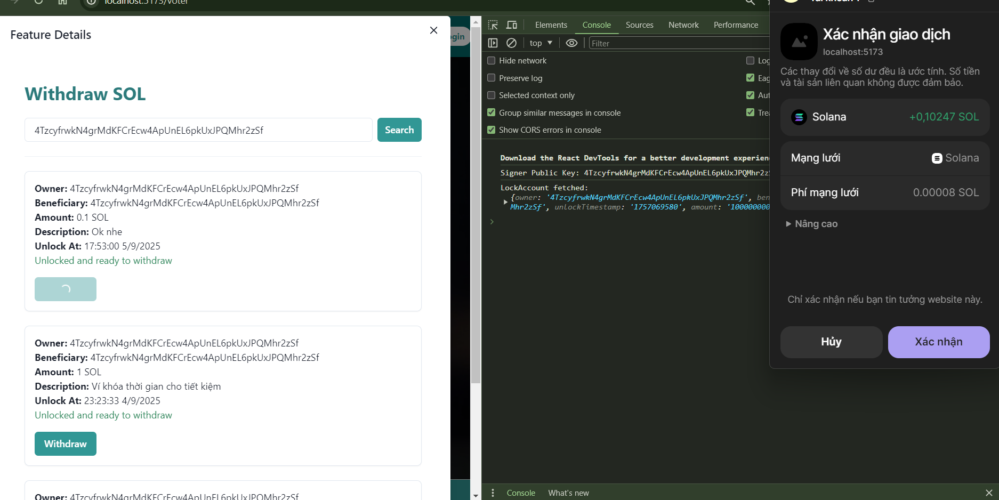
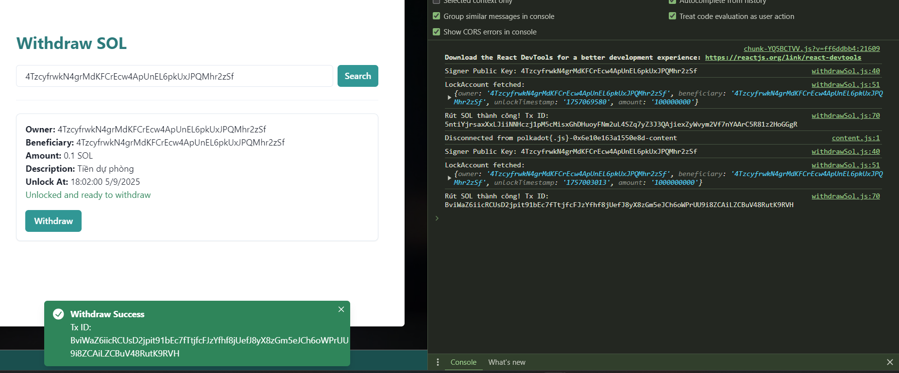
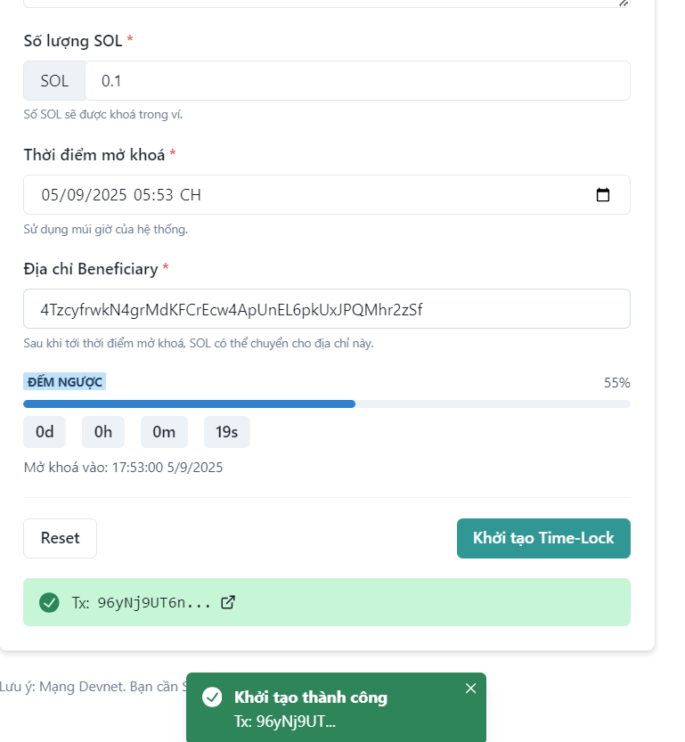

# ⏳ Time-Locked Wallet on Solana  

A **trustless, on-chain time-locked wallet** built with **Anchor, SPL Token, PDAs**, and a modern React frontend.  

This project allows users to **lock SOL or SPL tokens (e.g., USDC)** with:  
- **Custom unlock time** (countdown enforced on-chain)  
- **Designated beneficiary** (recipient address can differ from the locker)  
- **Optional description** (for personal notes, savings goals, or funding purposes)  

Frontend built with **Vite + React + Chakra UI**, featuring **Phantom wallet integration** for a smooth user experience.  

---

## 🌟 Features  

### Smart Contract (Anchor)  
- Lock **SOL & SPL tokens** into a PDA vault.  
- **Designated beneficiary**: funds can only be withdrawn by the assigned recipient.  
- **On-chain countdown timer**: unlock timestamp is enforced by the program logic.  
- **Withdraw mechanism**: available only after unlock time.  
- **Supports description metadata** for personalized use cases.  

### Frontend (React + Chakra UI)  
- **Wallet connection** via Phantom.  
- **User dashboard** with wallet state display (amount, unlock date, description).  
- **4 Core Actions:**  
  1. `CREATE SOL WALLET` – lock SOL with beneficiary + unlock time.  
  2. `CREATE SPL WALLET` – lock SPL tokens (e.g., USDC).  
  3. `WITHDRAW SOL` – claim SOL after countdown expires.  
  4. `WITHDRAW SPL` – claim SPL tokens after countdown expires.  
- **Clean UI/UX** with Chakra components and responsive layout.  

---

## 💡 Why It Matters  

This project demonstrates a **fundamental on-chain primitive** that unlocks many real-world use cases:  
- 🎓 **Scholarships or grants** with timed disbursements  
- 🏛 **DAO-controlled payouts** with enforced vesting  
- 👨‍👩‍👧 **Parental wallets** for kids (funds unlock at a specific age)  
- 💰 **Personal savings goals** with descriptions for motivation  
- 🤝 **Trust funds & inheritance wallets**  

---

## ✅ Deliverables  

### 1. Solana Program (Anchor)  
- `initialize_lock_sol` → Lock SOL into a PDA.  
- `initialize_lock_spl` → Lock SPL tokens.  
- `withdraw_sol` → Withdraw SOL (only allowed after unlock time).  
- `withdraw_spl` → Withdraw SPL tokens (only allowed after unlock time).  
- PDA securely holds the locked funds.  
- Unlock time is **enforced on-chain** (cannot withdraw before deadline).  

### 2. Frontend (Vite + React + Chakra UI)  
- Phantom wallet login flow.  
- Dashboard with wallet overview.  
- **Countdown timer** to visually display remaining lock time.  
- Form-based interaction for creating and withdrawing from vaults.  

### 3. GitHub Repo Structure  
```
/programs/time-locked-wallet -> Anchor smart contract
/app -> React frontend (Vite + Chakra UI)
README.md -> Setup & usage instructions
```
### 4. Deployment  
- Program deployed on **Solana Devnet**.  
- Example test accounts and walkthrough included.  

---

## 🚀 Getting Started  

### Prerequisites  
- [Rust](https://www.rust-lang.org/tools/install)  
- [Anchor](https://www.anchor-lang.com/docs/installation)  
- [Solana CLI](https://docs.solana.com/cli/install-solana-cli)  
- Node.js (>=18) & Yarn  

### 🛠 Tech Stack

- Blockchain: Solana, Anchor, SPL Token, PDAs

- Frontend: Vite, React.js, Chakra UI

- Wallets: Phantom integration

### Clone Repo  
```bash
git clone https://github.com/CptDat9/time-locked-wallet.git
cd time-locked-wallet
```
### 👤 Author
- Doan Dat (@CptDat9)
### 📌 Demo
 - Deployed on Solana Devnet
 - Optional: video walkthrough (coming soon)

### Preview
### - Login Page:


### - User Page:


### - Create locked funds


### - Withdraw





### - Test:



- Solscan:


